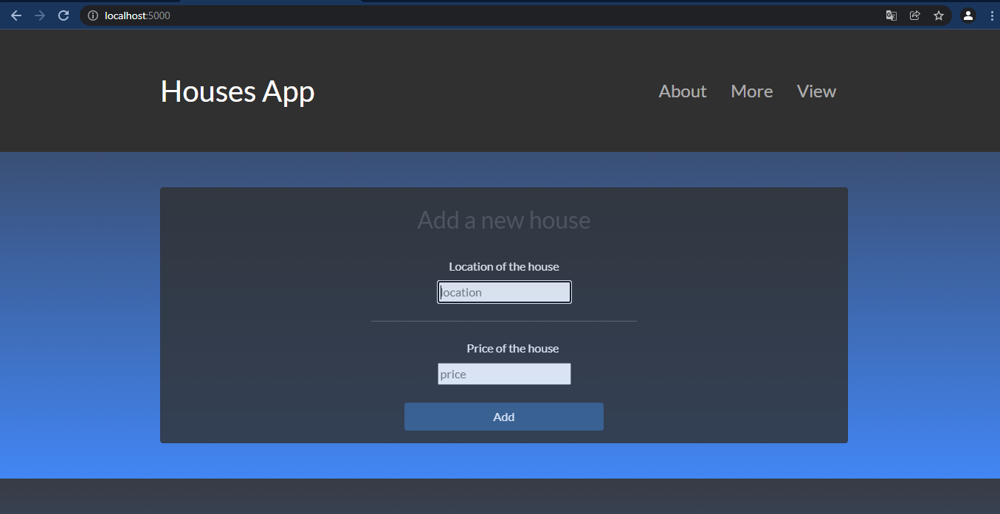

# Python Houses App.

__A web application for administration of houses. Make with python and sqlite3 as database.__

## Dependencies.

__Install of requirements file:__

```bash
pip3 install -r requirements.txt
```

## Installation with Docker.

```bash
docker build -d --publish 5000:5000 houses-app
```

## Manual.

__Clone the repository and execute:__

```bash
git clone https://www.github.com/EduardYan/python-houses-app.git
cd python-houses-app
python3 index.py

```

Now you can visite this direction from the browser <a href="http://localhost:5000">http://localhost:5000</a>


## Screenshot.


## Resources.
Css styles from <a href="https://bootswatch.com/">https://bootswatch.com</a>

## Errors or bugs.
Contact me <a href="mailto:eduarygp@gmail.com">eduarygp@gmail.com</a>